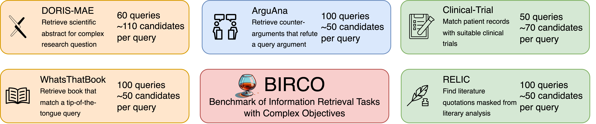
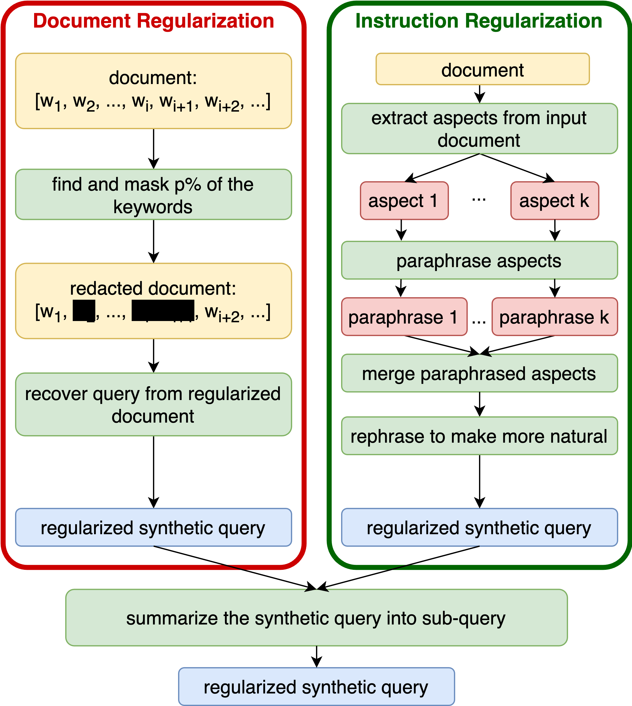
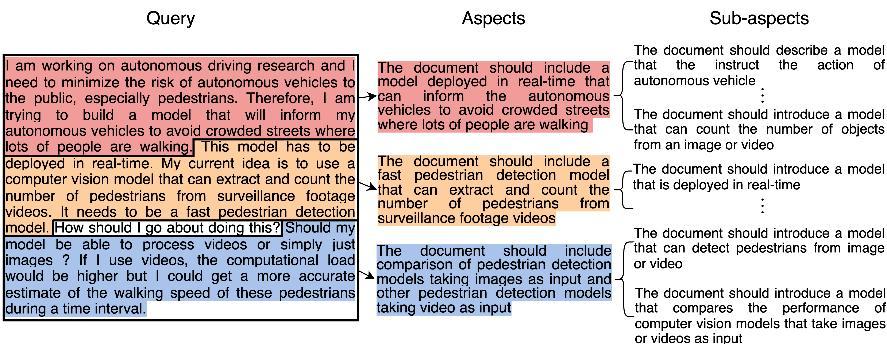

## Publication

  
  

    <h4>BIRCO: A Benchmark of Information Retrieval Tasks with Complex Objectives</h4>
    

    <b>Xiaoyue Wang*</b>, Jianyou Wang*, Kaicheng Wang*, Weili Cao*, Ramamohan Paturi, Leon Bergen 
    <!-- <em>Under Review</em>  -->
    <a href="https://arxiv.org/abs/2402.14151">arXiv</a> / <a href="https://github.com/BIRCO-benchmark/BIRCO">Code</a>
    

    

      We present the Benchmark of Information Retrieval (IR) tasks with Complex Objectives (BIRCO). BIRCO evaluates the ability of IR systems to retrieve documents given multi-faceted user objectives. The benchmark's complexity and compact size make it suitable for evaluating large language model (LLM)-based information retrieval systems. We present a modular framework for investigating factors that may influence LLM performance on retrieval tasks, and identify a simple baseline model which matches or outperforms existing approaches and more complex alternatives. No approach achieves satisfactory performance on all benchmark tasks, suggesting that stronger models and new retrieval protocols are necessary to address complex user needs.
    

  

  
  

    <h4>IR2: Information Regularization for Information Retrieval</h4>
    

    Jianyou Wang*, Kaicheng Wang*, <b>Xiaoyue Wang*</b>, Weili Cao, Ramamohan Paturi, Leon Bergen 
    <em>Proceedings of the 2024 Joint International Conference on Computational Linguistics, Language Resources and Evaluation (LREC-COLING 2024)</em> 
    <a href="https://aclanthology.org/2024.lrec-main.810/">LREC-COLING</a> / <a href="https://arxiv.org/abs/2402.16200">arXiv</a> / <a href="https://github.com/Info-Regularization/Information-Regularization">Code</a>
    

    

      Effective information retrieval (IR) in settings with limited training data, particularly for complex queries, remains a challenging task. This paper introduces a method of Information Regularization for synthetic query generation aimed at improving data augmentation techniques and consequently, IR systems, by preventing models from learning superficial features of queries. Our approach, representing a novel application of regularization techniques in synthetic data creation for IR, is tested on three recent IR tasks characterized by complex queries: DORIS-MAE, ArguAna, and WhatsThatBook. Experimental results indicate that our regularization techniques not only outperform previous synthetic query generation methods on the tasks considered but also reduce cost by up to 50%. Furthermore, this paper categorizes and explores three regularization methods at different stages of the query synthesis pipeline—input, prompt, and output—each offering varying degrees of performance improvement compared to models where no regularization is applied. This provides a systematic approach for optimizing synthetic data generation in data-limited, complex-query IR scenarios.
    

  

  
  

    <h4>DORIS-MAE: Scientific Document Retrieval using Multi-level Aspect-based Queries</h4>
    

    Jianyou Wang*, Kaicheng Wang*, <b>Xiaoyue Wang</b>, Prudhviraj Naidu, Leon Bergen, Ramamohan Paturi 
    <em>NeurIPS 2023, the Thirty-Seventh Annual Conference on Neural Information Processing Systems</em> 
    <a href="https://proceedings.neurips.cc/paper_files/paper/2023/hash/78f9c04bdcb06f1ada3902912d8b64ba-Abstract-Datasets_and_Benchmarks.html">NeurIPS</a> / <a href="https://arxiv.org/abs/2310.04678">arXiv</a> / <a href="https://github.com/Real-Doris-Mae/Doris-Mae-Dataset">Code</a>
    

    

      We propose a novel task, Scientific Document Retrieval using Multi-level Aspect-based queries (DORIS-MAE), which is designed to handle the complex nature of user queries in scientific research. We developed a benchmark dataset within the field of computer science, consisting of 50 complex, human-authored primary query cases. For each primary query, we assembled a collection of 100 relevant documents and produced annotated relevance scores for ranking them. Recognizing the significant labor of expert annotation, we also introduce a scalable framework for evaluating the viability of Large Language Models (LLMs) such as ChatGPT-3.5 for expert-level dataset annotation tasks.
    

  

## Selected Projects

  
  

    <h4>SON: Enhancing Prompt Understanding of Diffusion Models with Large Language Models Guided Layouts</h4>
    

    Weiyue Li*, Yi Li*, <b>Xiaoyue Wang*</b>, Hao Zhang 
    <em>2024 Outstanding Capstone Project Award</em> 
    <a href="https://weiyueli7.github.io/SON/">Website</a> / <a href="https://weiyueli7.github.io/SON/report/report.pdf">Paper</a> / <a href="https://drive.google.com/file/d/100QXLrC5NdG2Kyd8ImY7iSz4W_btVsSg/view">Poster</a> / <a href="https://github.com/weiyueli7/SON">Code</a>
    

    

      We introduce Spatial-Overlap-Numeracy-1K (SON-1K), a comprehensive benchmark for text-to-image generation. This benchmark comprises 1,000 complex prompts spanning three subtasks: spatial relationships, numeracy counts, and complex natural prompts. Alongside the benchmark, we propose several evaluation metrics to assess compliance with the prompts comprehensively. We also propose a new approach, the Language Model-Guided Diffusion++ (LMDpp), enhancing the performance of the novel two-stage Large Language Model (LLM)-grounded diffusion model pipeline (LMD). We report experimental results of previous major T2I models and our enhanced LMDpp, along with its baseline on SON-1K, and provide an analysis of our new metrics.
    

  

More coming soon...